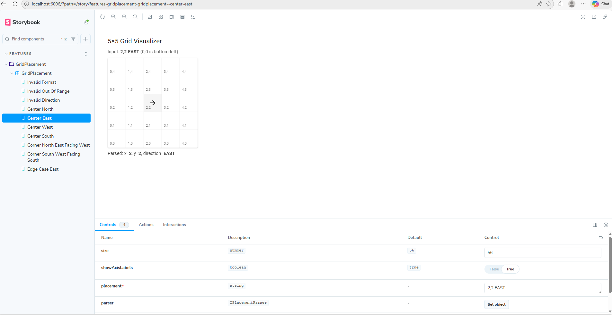
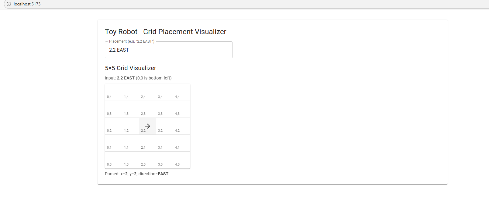

# Grid Placement App (Corporate Structure)

React + TypeScript + Vite + Material UI + Storybook + Vitest.

## Install

``` bash
npm i
```

## Run app

``` bash
npm run dev
```

## Run Storybook

``` bash
npm run storybook
```

Open: http://localhost:6006

The Storybook preview shows: - 5×5 grid layout - Robot arrow icon
rendered inside occupied cell - Coordinate labels - Parsed placement
summary - Error alert for invalid input - Interactive controls panel

## Run tests

``` bash
npm test
```

## Structure (high level)

-   `src/app` -- application shell (entrypoints, providers, config)
-   `src/features` -- feature modules (business capabilities)
-   `src/shared` -- shared domain + UI primitives + test utilities

## Storybook Preview




## Grid Display Preview



